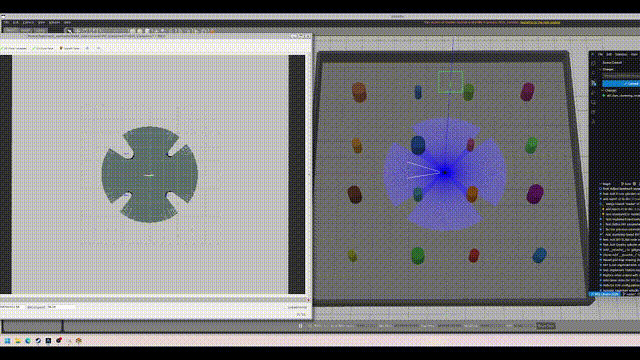

# EKF SLAM Package

This package implements Extended Kalman Filter (EKF) based SLAM for TurtleBot3 with two complementary approaches: feature-based SLAM using corner detection and clustering-based SLAM using point clustering. The system supports both structured indoor environments (bookstore) and unstructured outdoor environments (cylinder world). Includes comprehensive technical documentation, mathematical derivations, and implementation analysis.

Core Contributors: Jaisel Singh, Qinghua He, Huan Gu

## Package Structure

```
ekf_slam/
├── ekf_slam/                        # Python package
│   ├── __init__.py
│   ├── ekf_slam_node.py             # Feature-based EKF SLAM (Split-and-Merge)
│   └── ekf_slam_clustering_node.py  # Clustering-based EKF SLAM (DBSCAN)
├── launch/                          # Launch configurations
│   ├── ekf_slam.launch.py           # Feature-based SLAM launch
│   ├── ekf_slam_clustering.launch.py # Clustering-based SLAM launch
│   ├── navigation.launch.py         # Navigation stack launch
│   ├── robot_bookstore.launch.py    # Bookstore simulation launch
│   ├── robot_cylinder.launch.py     # Cylinder simulation launch
│   └── view_robot.launch.py         # Visualization launch
├── rviz/                            # RViz configurations
│   └── robot_view.rviz              # SLAM visualization config
├── worlds/                          # Gazebo simulation worlds
│   ├── bookstore/                   # Structured indoor environment ([source](https://github.com/mlherd/Dataset-of-Gazebo-Worlds-Models-and-Maps))
│   │   ├── bookstore.world          # World definition file
│   │   └── models/                  # 3D model assets
│   └── cylinder_world.world         # Unstructured outdoor environment
├── config/                          # Configuration files
│   └── nav2_params.yaml             # Navigation stack parameters
├── resource/                        # ROS2 package resources
│   └── ekf_slam                     # Package marker file
├── doc/                             # Documentation and demos
│   ├── report/                      # Technical report (LaTeX)
│   ├── ekfslam.mp4                  # New SLAM demonstration video
│   ├── demo.gif                     # Original demo animation
│   └── *.pdf                        # Previous report versions
├── package.xml                      # ROS2 package manifest
├── setup.py                         # Python package configuration
├── setup.cfg                        # Package setup configuration
└── README.md                        # This file
```

## Demo

### Latest Demonstration


*Complete EKF SLAM demonstration showing both feature-based and clustering-based approaches*

### Nav2 Navigation Test (Legacy)


*Navigation test using only odometry data with Nav2 stack in bookstore environment (before full EKF SLAM implementation)*

**Note**: The legacy demo shows basic navigation capabilities, while the main demo showcases the complete EKF SLAM system with landmark-based mapping.

## Technical Documentation

📄 **[Complete Technical Report](doc/EKF_SLAM_project_report_group18.pdf)**

*Comprehensive technical documentation including mathematical derivations, implementation details, experimental results, and performance analysis of the EKF SLAM system.*

## Prerequisites

- ROS 2 (Humble/Jazzy)
- Gazebo Classic
- TurtleBot3 packages
- Nav2 (optional, for navigation)

## Installation

### 1. Create ROS2 Workspace

Create a new ROS2 workspace and clone the repository:

```bash
# Create workspace directory
mkdir -p ~/ekf_slam_ws/src

# Clone the repository
cd ~/ekf_slam_ws/src
git clone https://github.com/White8848/EKF_SLAM_ROS2.git ekf_slam
```

### 2. Build the Package

Build the ROS2 package:

```bash
cd ~/ekf_slam_ws
colcon build --packages-select ekf_slam
source install/setup.bash
```

## Usage

### SLAM Approaches

This package provides two complementary EKF SLAM implementations:

1. **Feature-based SLAM** (`ekf_slam_node.py`): Uses Split-and-Merge line segmentation for corner detection, optimal for structured indoor environments like the bookstore world.

2. **Clustering-based SLAM** (`ekf_slam_clustering_node.py`): Uses DBSCAN clustering for point landmark detection, suitable for unstructured outdoor environments with cylindrical obstacles.

### 1. Launch Simulation Environment

Choose your simulation environment (select **one**):

**Bookstore World (Structured Indoor)** - Use with Feature-based SLAM:
```bash
ros2 launch ekf_slam robot_bookstore.launch.py
```

**Cylinder World (Unstructured Outdoor)** - Use with Clustering-based SLAM:
```bash
ros2 launch ekf_slam robot_cylinder.launch.py
```

Both commands will:
- Load the respective world in Gazebo
- Spawn TurtleBot3 Waffle Pi robot
- Publish static TF transforms (base_footprint → base_link → base_scan/imu_link/camera_*)

### 2. Run EKF SLAM Node

Choose the corresponding SLAM algorithm for your selected environment (select **one** that matches your environment):

**For Bookstore World (Feature-based SLAM)**:
```bash
ros2 launch ekf_slam ekf_slam.launch.py
```

**For Cylinder World (Clustering-based SLAM)**:
```bash
ros2 launch ekf_slam ekf_slam_clustering.launch.py
```

Both nodes will:
- Subscribe to `/scan` (laser data) and `/odom` (odometry)
- Build an occupancy grid map (`/map` topic)
- Publish estimated robot pose (`/ekf_pose`)
- Broadcast `map → odom` TF transform

### 3. Visualize in RViz

In another terminal, launch RViz with pre-configured displays:

```bash
ros2 launch ekf_slam view_robot.launch.py
```

RViz displays:
- **Grid**: Reference grid in odom frame
- **TF**: Coordinate frame tree visualization
- **LaserScan**: Laser points (red)
- **Map**: SLAM-generated occupancy grid
- **RobotModel**: 3D robot visualization
- **Global/Local Plan**: Navigation paths (if Nav2 running)
- **Costmap Footprints**: Robot footprint in costmaps

### 4. Control the Robot

Use keyboard teleoperation to move the robot for mapping:

```bash
ros2 run teleop_twist_keyboard teleop_twist_keyboard
```

**Controls:**
- `i` - Forward
- `k` - Stop
- `j` - Turn left
- `l` - Turn right
- `u/o/m/,` - Diagonal movements
- `q/z` - Increase/decrease speed

### 5. Optional: Run Nav2 Navigation (if available)

```bash
ros2 launch nav2_bringup navigation_launch.py
```

Set navigation goals in RViz using "2D Goal Pose" tool.

## Quick Start (All-in-One)

Run all commands in separate terminals:

### Option 1: Bookstore World (Feature-based SLAM)
```bash
# Terminal 1: Simulation
ros2 launch ekf_slam robot_bookstore.launch.py

# Terminal 2: EKF SLAM (Feature-based)
ros2 launch ekf_slam ekf_slam.launch.py

# Terminal 3: Visualization
ros2 launch ekf_slam view_robot.launch.py

# Terminal 4: Robot Control
ros2 run teleop_twist_keyboard teleop_twist_keyboard
```

### Option 2: Cylinder World (Clustering-based SLAM)
```bash
# Terminal 1: Simulation
ros2 launch ekf_slam robot_cylinder.launch.py

# Terminal 2: EKF SLAM (Clustering-based)
ros2 launch ekf_slam ekf_slam_clustering.launch.py

# Terminal 3: Visualization
ros2 launch ekf_slam view_robot.launch.py

# Terminal 4: Robot Control
ros2 run teleop_twist_keyboard teleop_twist_keyboard
```

## Configuration

### EKF SLAM Parameters

Both SLAM implementations share common parameters but have method-specific tuning:

#### Common Parameters (both launch files)
```python
parameters=[{
    'use_sim_time': True,
    'map_resolution': 0.05,      # Map resolution (meters/cell)
    'map_width': 400,            # Map width (cells)
    'map_height': 400,           # Map height (cells)
    'max_laser_range': 3.5,      # Maximum valid laser range (m)
    'min_laser_range': 0.12,     # Minimum valid laser range (m)
}]
```

#### Feature-based SLAM Parameters (`ekf_slam.launch.py`)
```python
parameters=[{
    # ... common parameters ...
    'split_merge_threshold': 0.05,  # Line segmentation threshold (m)
    'min_line_length': 0.3,         # Minimum line length for corner detection (m)
    'corner_angle_threshold': 80,   # Corner angle range (degrees)
    'association_threshold': 1.0,   # Mahalanobis distance threshold
}]
```

#### Clustering-based SLAM Parameters (`ekf_slam_clustering.launch.py`)
```python
parameters=[{
    # ... common parameters ...
    'eps': 0.3,                    # DBSCAN epsilon (m)
    'min_samples': 5,              # DBSCAN minimum samples
    'association_threshold': 6.0,  # Mahalanobis distance threshold (higher for outdoor)
}]
```

### RViz Configuration

Modify `rviz/robot_view.rviz` or save your custom layout from RViz.

## Topics

### Subscribed Topics
- `/scan` (sensor_msgs/LaserScan) - Laser scan data
- `/odom` (nav_msgs/Odometry) - Robot odometry

### Published Topics
- `/map` (nav_msgs/OccupancyGrid) - SLAM-generated occupancy grid map
- `/ekf_pose` (geometry_msgs/PoseStamped) - Estimated robot pose from EKF
- `/landmarks` (geometry_msgs/PoseArray) - Detected landmark positions
- `/clusters` (geometry_msgs/PoseArray) - Detected point clusters (clustering-based only)

### TF Frames
- `map` → `odom` (published by EKF SLAM node)
- `odom` → `base_footprint` (published by Gazebo diff_drive controller)
- `base_footprint` → `base_link` → `base_scan/imu_link/camera_*` (static TF publishers)

## Troubleshooting

### Robot falls through ground
- Check `GAZEBO_MODEL_PATH` is set correctly
- Verify bookstore world models are installed

### No laser scan in RViz
- Ensure TF tree is complete: `ros2 run tf2_tools view_frames`
- Check `/scan` topic: `ros2 topic echo /scan`
- Verify `use_sim_time: True` in all nodes

### Map not updating
- Confirm robot is moving (teleop working)
- Check EKF SLAM node is running: `ros2 node list`
- Verify `/odom` topic is publishing: `ros2 topic hz /odom`

### TF timestamp errors (controller_server)
- These come from Nav2 nodes if `use_sim_time` not set
- Won't affect SLAM functionality
- Fix by adding `use_sim_time: True` to Nav2 launch file

## Problem Statement and Solution

### Problem Solved

This project addresses the challenge of Simultaneous Localization and Mapping (SLAM) for mobile robots in diverse environments. Traditional SLAM approaches often struggle with environment variability - performing well in structured indoor spaces but failing in unstructured outdoor settings, or vice versa.

### Solution Approach

We implement a **dual EKF-SLAM framework** that adapts to different environmental conditions:

**Feature-based SLAM** (Indoor/Structured):
- Uses Split-and-Merge line segmentation for geometric feature extraction
- Detects corner landmarks at line intersections
- Optimized for environments like bookstores with clear geometric structures

**Clustering-based SLAM** (Outdoor/Unstructured):
- Employs DBSCAN clustering for point cloud segmentation
- Extracts cluster centroids as landmark positions
- Robust in environments with irregular obstacles like cylinder worlds

### Implementation Status

- ✅ **Completed**: EKF-SLAM core implementation with manual robot operation
- ✅ **Completed**: Integration with Gazebo simulation, RViz visualization, and keyboard teleoperation
- ✅ **Completed**: Autonomous navigation and exploration algorithms

### Key Innovations

- **Environment-Adaptive SLAM**: Automatic algorithm selection based on environmental characteristics
- **Real-time Performance**: Efficient processing at 5-10 Hz for robotic applications
- **Robust Data Association**: Mahalanobis distance-based landmark matching with numerical stability
- **Complete ROS2 Integration**: Full compatibility with modern robotics frameworks

## System Architecture

### EKF SLAM Overview

This implementation follows the classical Extended Kalman Filter approach to Simultaneous Localization and Mapping:

1. **State Representation**: The system maintains a joint state vector containing robot pose and landmark positions
2. **Prediction Step**: Uses velocity motion model to predict robot motion and propagate uncertainty
3. **Update Step**: Incorporates landmark observations to correct the state estimate
4. **Data Association**: Matches observations to existing landmarks using Mahalanobis distance
5. **Landmark Initialization**: Adds new landmarks to the state when reliable observations are detected

### Feature-based SLAM (`ekf_slam_node.py`)

**Landmark Detection**:
- Split-and-Merge algorithm for line segmentation
- Corner detection at line intersections
- Optimized for structured indoor environments (bookstore)

**Algorithm Flow**:
1. Extract line segments from laser scan
2. Detect corners at line intersections
3. Associate corners with existing landmarks
4. Initialize new landmarks when association fails
5. Update EKF with matched observations

### Clustering-based SLAM (`ekf_slam_clustering_node.py`)

**Landmark Detection**:
- DBSCAN clustering for point aggregation
- Centroid extraction as landmark positions
- Optimized for unstructured outdoor environments (cylinder world)

**Algorithm Flow**:
1. Apply DBSCAN to laser scan points
2. Extract cluster centroids as landmarks
3. Associate centroids with existing landmarks
4. Initialize new landmarks from unassociated clusters
5. Update EKF with matched observations

### Mathematical Foundation

The system implements the following key equations:

- **Motion Model**: Velocity-based model with Jacobian computation
- **Measurement Model**: Range-bearing observations with nonlinear transformations
- **Kalman Gain**: Optimal weighting between prediction and measurement
- **Covariance Update**: Joseph form for numerical stability
- **Data Association**: Mahalanobis distance gating

### Performance Characteristics

- **Real-time Operation**: Processes laser scans at 5-10 Hz
- **Memory Efficient**: Sparse state representation with landmark management
- **Numerically Stable**: Comprehensive safeguards against filter divergence
- **Environment Adaptive**: Complementary algorithms for different scenarios

## Development

### File Locations
- **Feature-based SLAM**: `ekf_slam/ekf_slam_node.py`
- **Clustering-based SLAM**: `ekf_slam/ekf_slam_clustering_node.py`
- **Launch files**: `launch/*.launch.py`
- **World files**: `worlds/bookstore/bookstore.world`, `worlds/cylinder_world.world`
- **Robot models**: `worlds/bookstore/models/turtlebot3_waffle_pi/`
- **Technical documentation**: `doc/report/main.tex` (LaTeX report)
- **Configuration**: `config/nav2_params.yaml`

### Building After Changes

```bash
cd ~/ekf_slam_ws
colcon build --packages-select ekf_slam --symlink-install
source install/setup.bash
```

Use `--symlink-install` to avoid rebuilding after Python file changes.

## License

Apache License 2.0

## Maintainer

- **Author**: White8848
- **Repository**: [EKF_SLAM_ROS2](https://github.com/White8848/EKF_SLAM_ROS2)
- **Email**: qinghuaharry1204@gmail.com

## Acknowledgments

- **ROS 2 Community** - For the robust robotics framework
- **TurtleBot3** - Robot platform and simulation models
- **Gazebo Classic** - Physics simulation environment
- **AWS Robomaker** - Retail environment models
- **[Dataset of Gazebo Worlds, Models and Maps](https://github.com/mlherd/Dataset-of-Gazebo-Worlds-Models-and-Maps)** - Bookstore simulation world
- **Nav2** - Autonomous navigation stack
- **Columbia University Mechanical Engineering** - Academic guidance and support

## Features Overview

- ✅ **Dual SLAM Approaches**: Feature-based (Split-and-Merge) and clustering-based (DBSCAN) implementations
- ✅ **Multi-Environment Support**: Structured indoor (bookstore) and unstructured outdoor (cylinder) worlds
- ✅ **Complete EKF Pipeline**: Motion prediction, measurement updates, landmark management, and state augmentation
- ✅ **Robust Data Association**: Mahalanobis distance-based landmark matching with configurable thresholds
- ✅ **Real-time Performance**: Efficient algorithms suitable for robotic applications
- ✅ **Comprehensive Visualization**: RViz integration with custom display configurations
- ✅ **ROS2 Integration**: Full compatibility with ROS2 Humble/Jazzy and Nav2 navigation stack
- ✅ **Technical Documentation**: Complete LaTeX report with mathematical derivations and implementation analysis
